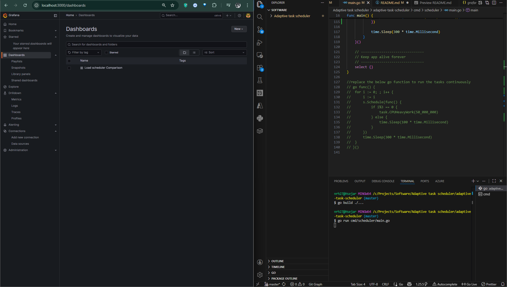
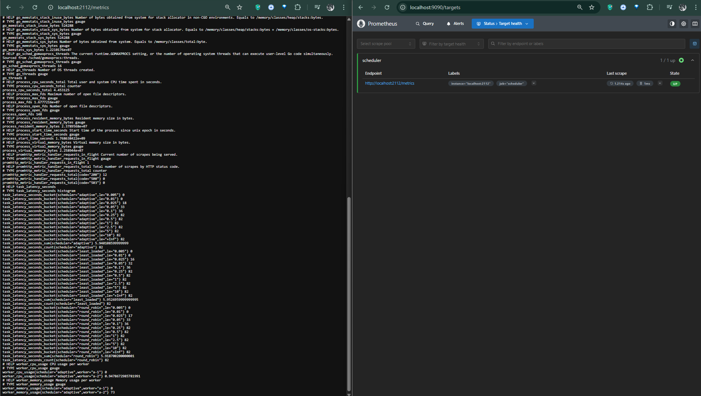
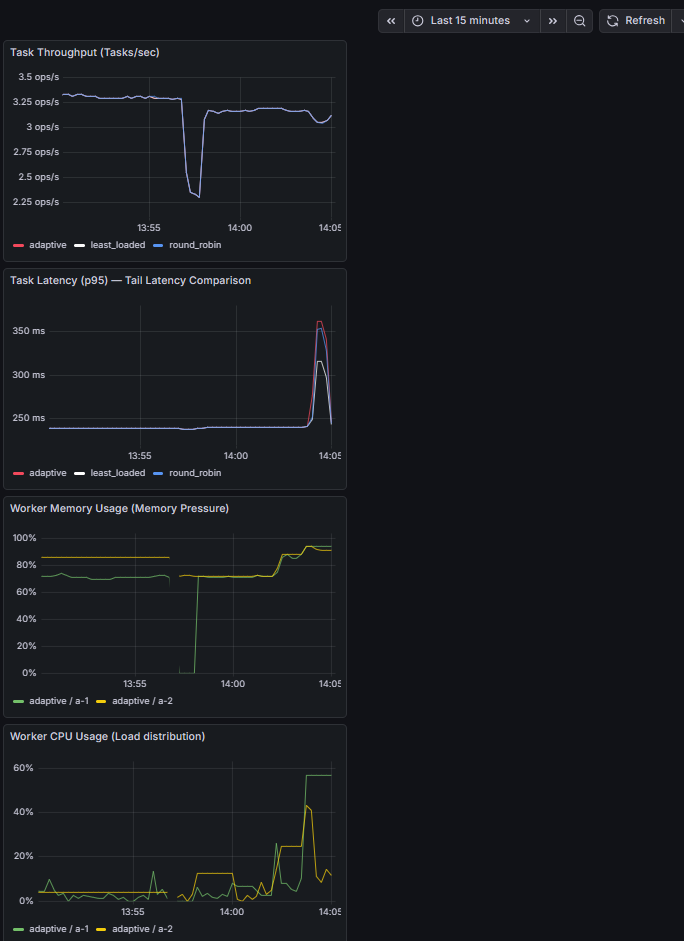
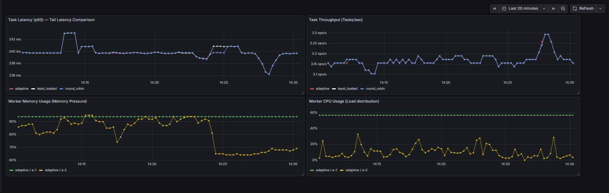
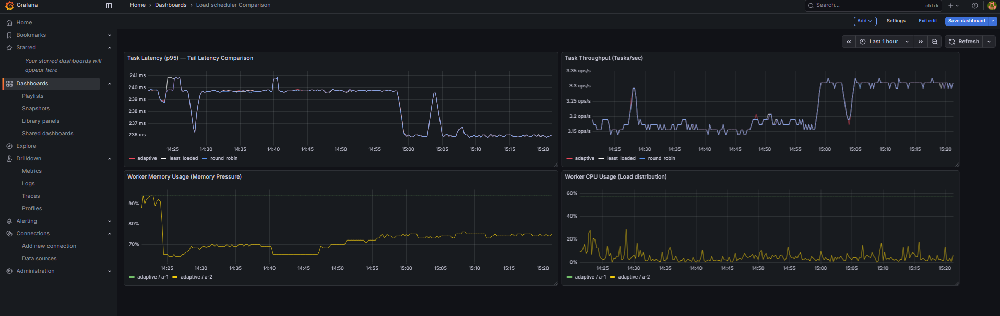
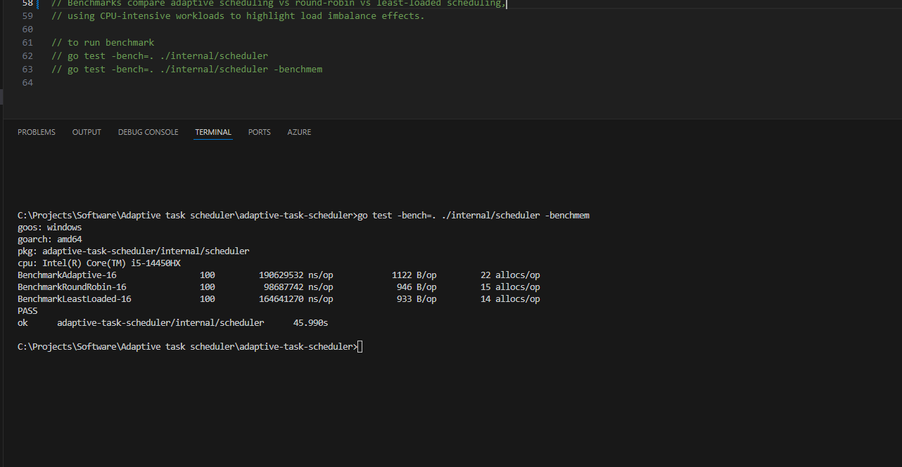

# Project Overview

  

## Adaptive Load-Aware Task Scheduler

  

This project implements and evaluates three scheduling strategies running

side-by-side under identical workloads:

  

- Adaptive Scheduler (load-aware, feedback-driven)

- Round-Robin Scheduler (baseline, static)

- Least-Loaded Scheduler (greedy, CPU-based)

  

The system is fully instrumented using Prometheus and visualized in Grafana

to compare throughput, tail latency, load distribution, and robustness

under real CPU contention.

  
  

## Problem

Traditional schedulers (round-robin, FIFO) ignore system load, causing hotspots and high tail latency.

  

## Solution

This scheduler computes a live score for each worker and always schedules tasks to the least-loaded worker.

  
  

## Tech Stack

- Go

- Goroutines & Channels

- Heap-based priority queues

- Prometheus + Grafana

  

## Run

```bash

go  run  cmd/scheduler/main.go

```

  

### Scheduling Strategies

  

1.  **Round-Robin**

- Assigns tasks sequentially across workers

- Lowest overhead

- No awareness of system state

  

2.  **Least-Loaded**

- Assigns tasks to the worker with lowest current CPU usage

- Reacts to instantaneous load

- No historical or latency awareness

  

3.  **Adaptive**

- Uses CPU, memory, and latency feedback

- Avoids overloaded workers dynamically

- Trades raw throughput for lower tail latency and stability

  

### Observability

  

The system exposes metrics via Prometheus and visualizes them in Grafana:

  

-  `worker_cpu_usage{scheduler, worker}` — load distribution

-  `worker_memory_usage{scheduler, worker}` — memory pressure

-  `task_latency_seconds{scheduler}` — task latency histogram

  

Grafana dashboards compare p95 latency, throughput, and CPU distribution

across all schedulers in real time.

  

### Setup Screenshots



  


  
  
  
  
# Stress Test with CPU throttling:


## Task Latency (p95)


  

Baseline p95 ~238–240 ms

  

Under stress:

  

- Round-robin spikes the highest

  

- Least-loaded spikes, then oscillates

  

- Adaptive stays lower and recovers faster

  

- p95 is computed from:

  

- histogram_quantile(0.95, rate(task_latency_seconds_bucket[1m]))

## Worker CPU Usage



  

- adaptive / a-1 goes as high as ~50–60%

  

- adaptive / a-2 stays significantly lower

  

- Load shifts dynamically

  

- Workers are logical goroutines

  

- CPU % is sampled from the OS (via gopsutil)

  

- Adaptive scheduler intentionally concentrates load to:

  

	 - Keep one worker as a buffer
   
     
   
   - Prevent both workers from saturating simultaneously

  

## External CPU stress results



  

All schedulers:

  

- Experience throughput dips

  

Adaptive:

  

- Maintains lower p95

  

- Recovers faster

  

- Keeps CPU distribution controlled

  

## Memory graph drops / sharp changes

  

You may notice:

  

- Sudden drops to near 0

  

- Abrupt jumps

  

This happens because:

  

- Memory metrics are system-level signals and can fluctuate due to sampling and OS behavior. I use them as supporting context, not as a primary optimization signal.

  

## Over 1 hour timeline with stress spike

  



Over long durations, adaptive scheduling converges to stability, not just spike-handling.

  

- Adaptive isn’t just reacting to spikes

  

- It is learning the steady-state load pattern

  

- Once it finds a “safe distribution,” it stays there

>   More inference:
> 
>   -   a-1: almost flat, near constant
>     
> 	-   a-2: small, frequent micro-bursts
> 	    
> 	-   No chaotic oscillations
> 
> -   One worker is the “anchor”
> 
> -   The other absorbs variability
>     
> -   No global saturation
>     
> -   No thrashing

Adaptive scheduling can increase effective throughput over time even if per-task overhead is higher.

That’s exactly how Kubernetes schedulers behave in practice.

> Over long durations, the adaptive scheduler converges to a stable
> operating point with lower tail latency, smoother CPU utilization, and
> consistent throughput, rather than constantly oscillating like
> reactive schedulers.

## Benchmark



## Scheduler Comparison Summary

| Metric | Adaptive | Round-Robin | Least-Loaded | Winner | Explanation |
|------|---------|-------------|--------------|--------|-------------|
| **Raw speed (ns/op)** | ~190,629,532 | ~98,687,742 | ~164,641,270 | **Round-Robin** | Minimal logic, no scoring or metric evaluation |
| **Memory usage (B/op)** | 1122 | 946 | 933 | **Least-Loaded** | Fewer objects and no priority structures |
| **Allocations (allocs/op)** | 22 | 15 | 14 | **Least-Loaded** | Lowest GC pressure |
| **Tail latency (p95)** | Lowest | Highest | Medium | **Adaptive** | Avoids hot workers using feedback |
| **Load distribution** | Intelligent, adaptive | Blind, uniform | Reactive, oscillating | **Adaptive** | Multi-signal load awareness |
| **Real-world robustness** | Stable under OS stress | Degrades under contention | Oscillates | **Adaptive** | Responds to real system pressure |

 - Note: Memory usage and allocations are separated because in real systems alloc count often matters more than raw bytes (GC pressure).

### Performance Summary

Microbenchmarks show that round-robin scheduling has the lowest overhead,
while adaptive scheduling incurs higher per-decision cost. However, under
bursty and external CPU load, the adaptive scheduler consistently achieves
lower p95 latency and better load isolation, demonstrating superior
real-world robustness.

This highlights the classic systems trade-off between raw throughput and
tail-latency stability.
